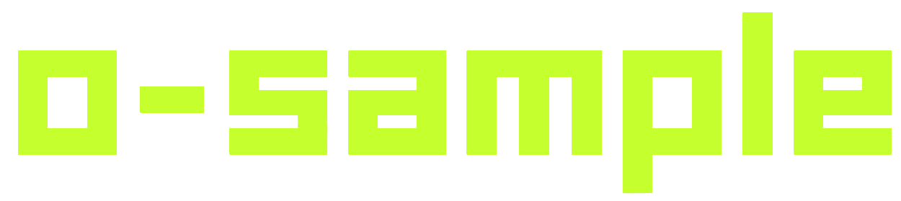
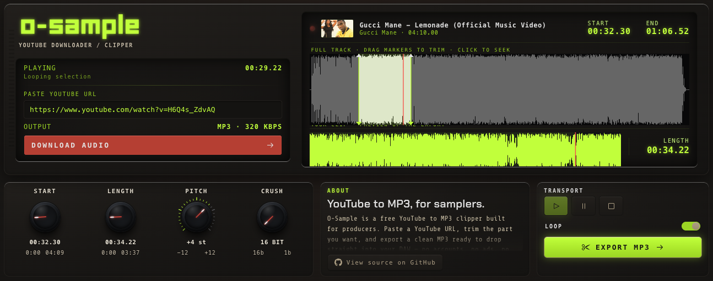

<p align="center">
  
</p>

<p align="center">
  <strong>A free YouTube → MP3 clipper, built for music producers.</strong><br/>
  Paste a URL, drag the markers to trim, drop the MP3 straight into your DAW.<br/>
  No signups, no ads, no watermarks.
</p>

<p align="center">
  
</p>

---

## Download

Grab a ready-to-run build from the [**latest release**](https://github.com/chronoshivt/o-sample/releases/latest) — no terminal, no Node, no Bun. Pick the file for your machine:

| Your machine                 | Download                          |
| ---------------------------- | --------------------------------- |
| macOS (Apple Silicon)        | `o-sample-darwin-arm64.tar.gz`    |
| macOS (Intel)                | `o-sample-darwin-x64.tar.gz`      |
| Linux (x64)                  | `o-sample-linux-x64.tar.gz`       |
| Linux (ARM64)                | `o-sample-linux-arm64.tar.gz`     |
| Windows (x64)                | `o-sample-win32-x64.zip`          |

**macOS / Linux** — extract and run:

```bash
tar -xzf o-sample-*.tar.gz
./o-sample
```

**Windows** — unzip and double-click `o-sample.exe`.

Your browser opens to the app automatically. Each download has a `.sha256` sidecar to verify it (`shasum -a 256 -c o-sample-*.tar.gz.sha256`).

> **macOS first run:** the binary is unsigned, so macOS may say it "cannot be opened." Right-click it → **Open** → **Open**, or run `xattr -d com.apple.quarantine ./o-sample` once.

> First launch downloads `yt-dlp` and `ffmpeg` (~80 MB, one-time, cached). After that the app runs fully offline.

Prefer to build it yourself? Keep reading.

## Get it running

You'll need a terminal and two free tools installed first:

- [**Node.js**](https://nodejs.org) (v20 or newer)
- [**Bun**](https://bun.sh) (one-line install on their site)

Then clone and install:

```bash
git clone https://github.com/chronoshivt/o-sample.git
cd o-sample
npm install
```

From there, two ways to run it — pick whichever you prefer.

### Option A — just run it (easiest)

```bash
npm run dev
```

Open <http://localhost:5173> in your browser. Keep the terminal open while you use it. That's all you need; you can stop here.

### Option B — build a standalone app

If you'd rather have a single double-clickable app instead of running `npm run dev` each time:

```bash
npm run build:exe
```

That produces a self-contained binary. Run it whenever:

```bash
./dist/o-sample          # macOS / Linux
.\dist\o-sample.exe      # Windows
```

Your browser opens to the app automatically.

---

Either way, paste a YouTube URL, trim, click **EXPORT**. Done.

The first run downloads `yt-dlp` and `ffmpeg` (the tools that fetch and process audio — about 80 MB, one-time). They get cached, so after that the app is fully offline.

## Where things go

| What                          | Where                          |
| ----------------------------- | ------------------------------ |
| Cached YouTube audio          | `~/.o-sample/downloads/`       |
| Bundled `yt-dlp` and `ffmpeg` | `~/.o-sample/bin/`             |
| Your exported MP3s            | Your browser's downloads folder |

Delete `~/.o-sample/` any time to start fresh.

## License

[MIT](./LICENSE) — free to use, modify, and share. Just don't hold the maintainers liable. For personal, fair-use clipping (e.g. sampling for music production); respect YouTube's Terms of Service and content creators' rights.

---

<details>
<summary><strong>For developers and self-hosters</strong></summary>

### Run from source

```bash
npm install
npm run dev
```

- UI on <http://localhost:5173> (Vite, hot reload)
- API on <http://localhost:3847> (Bun)

If `yt-dlp` and `ffmpeg` aren't on your `PATH`, the dev server downloads them to `vendor/` on first start (same ~80 MB cache as the exe build). If they *are* on `PATH` (e.g. `brew install yt-dlp ffmpeg`), those get used instead — handy for keeping yt-dlp current via `brew upgrade`.

### Layout

```
client/    # React + Vite frontend
server/    # Bun HTTP server, talks to yt-dlp + ffmpeg
scripts/   # build-exe.ts (one-shot exe builder)
```

### Scripts

| Command             | What it does                                  |
| ------------------- | --------------------------------------------- |
| `npm run dev`       | Client + server in parallel, with hot reload  |
| `npm run build`     | Build the client into `client/dist/`          |
| `npm run build:exe` | Build a standalone exe for your platform     |
| `npm test`          | Server test suite                             |

### Server config

Everything's an env var, all optional. See [`server/.env.example`](./server/.env.example) for the full list. The interesting ones:

- `YT_PROXY` — HTTP/SOCKS5 proxy (residential proxies dodge YouTube's anti-bot checks)
- `YT_COOKIES_FILE` — Netscape cookies file for authenticated requests
- `YT_PLAYER_CLIENT` — override yt-dlp's player client (e.g. `tv_embedded`)

### Self-hosting with Docker

```bash
docker build -t o-sample-server -f server/Dockerfile server/
docker run -p 3847:3847 o-sample-server
```

Build the client separately (`npm run build` → `client/dist/`) and host it on any static host (Netlify, Cloudflare Pages, etc). Point it at your server via `VITE_SAMPLE_SERVER_ORIGIN`.

### Build internals

`server/embedded-assets.gen.ts` and `server/vendored-binaries.gen.ts` are committed as empty stubs and rewritten by `npm run build:exe`. After a build, `git checkout server/*.gen.ts` resets them. The `vendor/` and `dist/` directories are gitignored — safe to delete to force a fresh build.

</details>
